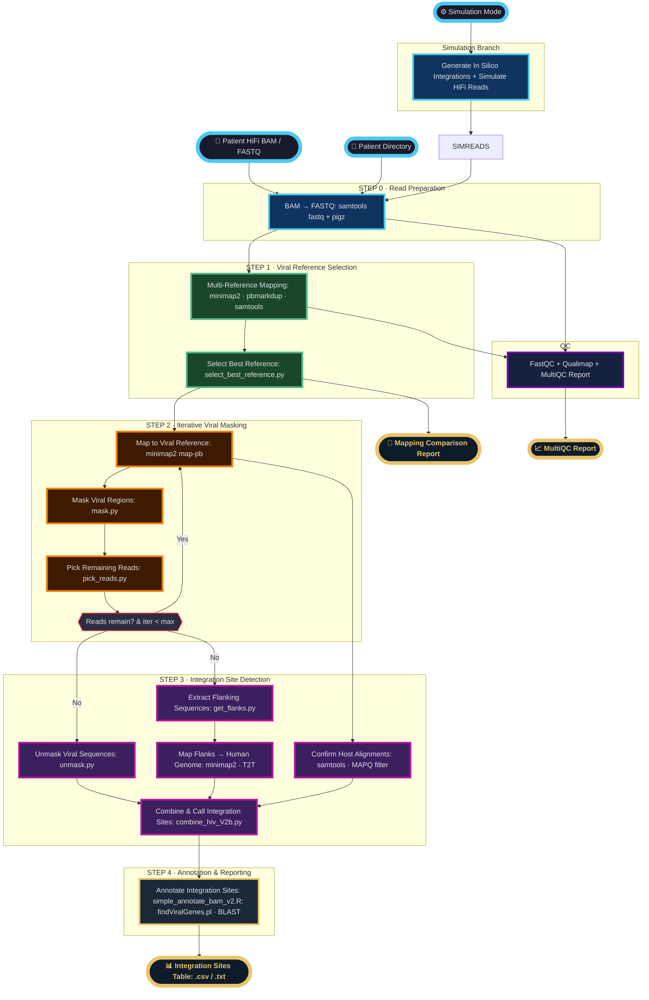

# Detecting viral integration with: NF-Viral-Integration
- This is a nextflow pipeline for detecting HIV (and or general viral) integration sites using PacBio HiFi sequencing data across a host. Implements the SMRTCap methodology with iterative mapping and multi-reference viral genome support.


## Pipeline Overview



## Requirements
- **Nextflow** (Tested on: 25.12.0-edge.10747)
- **Container runtime**: Singularity, Apptainer, or Docker
- **Host reference genome and GTF**: HG38/T2T
- **HIV viral genomes**: HIV-A, HIV-B, etc.

## Download human genome
- We used the T2T reference genome for mapping: https://github.com/marbl/CHM13

```bash
# Download T2T and annotation
wget https://s3-us-west-2.amazonaws.com/human-pangenomics/T2T/CHM13/assemblies/analysis_set/chm13v2.0_maskedY_rCRS.fa.gz
wget https://s3-us-west-2.amazonaws.com/human-pangenomics/T2T/CHM13/assemblies/annotation/chm13v2.0_RefSeq_Liftoff_v5.2.gff3.gz

# Convert GFF3 to GTF (Will add as module soon)
module load singularity

# Genome toolkit
cd sif
singularity pull docker://biocontainers/genometools:v1.5.10ds-3-deb_cv1

# Convert
gunzip chm13v2.0_RefSeq_Liftoff_v5.2.gff3.gz
singularity exec genometools_v1.5.10ds-3-deb_cv1.sif \\
  gt gff3_to_gtf chm13v2.0_RefSeq_Liftoff_v5.2.gff3 > chm13v2.0_RefSeq_Liftoff_v5.2.gtf
```

### Testing
Run the built-in test profile to verify your installation works before using real data. This uses a small real-world dataset bundled with the pipeline. You do have to provide a host genome (human) and a gtf. 

```bash
# Load modules
module load singularity 
module load nextflow

# Run pipeline
nextflow run main.nf \
  --host_genome /path/to/host.fa.gz \
  --gtf /path/to/host.gtf \
  -profile test,singularity \
  -resume \
  -bg 
```

## HPC Usage
For SLURM-based HPC systems:

```bash
# Clone the repository
git clone https://github.com/connor122721/nf-viral-integration.git
cd nf-viral-integration

# Load modules
module load singularity 
module load nextflow

# Run pipeline
nextflow run main.nf \
  --patient_dir /path/to/data/* \
  --host_genome /path/to/host.fa.gz \
  --gtf /path/to/host.gtf \
  --viral_genomes /path/to/hiv_panel.fa \
  --outdir ./nf_output \
  -profile slurm,singularity \
  -resume \
  -bg 
```

Or, to run the pipeline off of GitHub directly use (this pulls the latest version):

```bash
# Load modules
module load singularity 
module load nextflow

# Run pipeline
nextflow run connor122721/nf-viral-integration -latest \ 
  --patient_dir /path/to/data/* \
  --host_genome /path/to/host.fa \
  --gtf /path/to/host.gtf \
  --viral_genomes /path/to/hiv_panel.fa \
  --outdir ./nf_output \
  -profile slurm,singularity \
  -resume \
  -bg
```

## Pipeline Overview

This pipeline detects viral integration sites through:
1. **Iterative mapping** to viral and host genomes
2. **Integration site detection** from chimeric reads
3. **Multi-reference support** for HIV subtypes (A, B, C, D, HIV-2, SIV)

## Input Data

### Required Files
- **PacBio HiFi reads**: FASTQ or BAM format
    -  We assume all samples are demultiplexed and adaptors are removed!
- **Host genome**: FASTA reference (e.g., hg38, t2t)
- **Viral references**: Multi-FASTA with viral genomes
- **Nextflow config**: Edited so it handles your HPC/compute environment

### Example Viral Reference Panel
The pipeline supports multiple HIV references for optimal mapping (naming of the fastas are arbitrary):

```
HIV-1_subtype_A.fa
HIV-1_subtype_B.fa
HIV-1_subtype_C.fa
HIV-1_subtype_D.fa
HIV-2.fa
SIV.fa
```

## Output Structure
```
output/
├── 01_reference_selection/  # Initial viral alignments
├── 02_iterative_masking/    # Exhaustive viral alignments
├── 03_flank_host_mapping/   # Host genome alignments
└── 04_final_results/        # Detected integrations summary statistics
```

## Key Parameters
```bash
--patient_dir        # Input HiFi reads (FASTQ/BAM)
--host_genome        # Host reference genome (FASTA)
--viral_refs         # Viral reference genome(s) (FASTA)
--outdir             # Output directory [default: ./results]
```

## Container Profiles
```bash
# Singularity
-profile singularity

# Apptainer
-profile apptainer

# Test if it works with lightweight example!
-profile test
```

## Pipeline Methodology
Based on SMRTCap protocol for viral integration detection:

1. Filter HiFi reads by quality and length
2. Map to viral reference panel (selects best-matching subtype)
3. Extract unmapped and partially mapped reads
4. Iteratively map to host genome
5. Report integration breakpoints

## Citation
Still in development! If you use this pipeline, please cite:

  ***Development and validation of HIV SMRTcap for the characterization of HIV-1 reservoirs across tissues and subtypes***
  Sadri G, Nadakal ST, Lauer W, Kos J, Singh PK, et al. (2026) Development and validation of HIV SMRTcap for the characterization of HIV-1 reservoirs across tissues and subtypes. *PLOS Pathogens* 22(1): e1013171. https://doi.org/10.1371/journal.ppat.1013171

## Support
For questions or issues:
- Open an issue on [GitHub](https://github.com/connor122721/nf-viral-integration/issues)
- Email: ***connor.murray.2@louisville.edu***

---

**Develped by: Connor S. Murray, Ph.D.**  
University of Louisville School of Medicine | Dept. of Biochemistry & Molecular Genetics