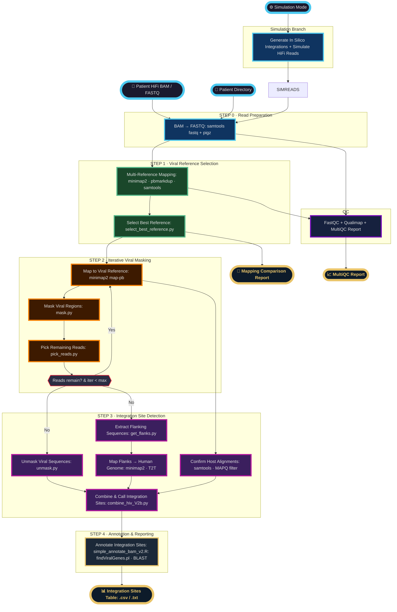

# Detecting viral integration with: NF-Viral-Integration
- This is a nextflow pipeline for detecting HIV (and or general viral) integration sites using PacBio HiFi sequencing data across a host. Implements the SMRTCap methodology with iterative mapping and multi-reference viral genome support.

## Pipeline Overview

```mermaid
flowchart TD
    classDef input     fill:#1a1a2e,stroke:#4cc9f0,stroke-width:8px,color:#e0e0e0
    classDef qc        fill:#16213e,stroke:#7209b7,stroke-width:4px,color:#e0e0e0
    classDef step0     fill:#0f3460,stroke:#4cc9f0,stroke-width:4px,color:#e0e0e0
    classDef step1     fill:#1a472a,stroke:#52b788,stroke-width:4px,color:#e0e0e0
    classDef step2     fill:#3d1a00,stroke:#f77f00,stroke-width:4px,color:#e0e0e0
    classDef step3     fill:#3b1f5e,stroke:#b5179e,stroke-width:4px,color:#e0e0e0
    classDef step4     fill:#1b2838,stroke:#e9c46a,stroke-width:4px,color:#e0e0e0
    classDef output    fill:#0d1b2a,stroke:#e9c46a,stroke-width:8px,color:#e9c46a,font-weight:bold
    classDef decision  fill:#2b2d42,stroke:#ef233c,stroke-width:2px,color:#e0e0e0

    %% ── INPUTS ──────────────────────────────────────────────────────────────
    IN1([🧬 Patient HiFi BAM / FASTQ]):::input
    IN2([📁 Patient Directory]):::input
    IN3([⚙️  Simulation Mode]):::input

    %% ── STEP 0: Read Preparation ─────────────────────────────────────────
    subgraph S0 ["  STEP 0 · Read Preparation  "]
        direction TB
        BTOFQ["BAM → FASTQ: samtools fastq + pigz"]:::step0
    end

    %% ── SIMULATION BRANCH ────────────────────────────────────────────────
    subgraph SIM ["  Simulation Branch  "]
        direction TB
        GENINT["Generate In Silico Integrations + Simulate HiFi Reads"]:::step0
    end

    %% ── QC ───────────────────────────────────────────────────────────────
    subgraph QC ["  QC  "]
        direction LR
        FASTQC["FastQC + Qualimap + MultiQC Report"]:::qc
    end

    %% ── STEP 1: Reference Selection ──────────────────────────────────────
    subgraph S1 ["  STEP 1 · Viral Reference Selection  "]
        direction TB
        MULTIMAP["Multi-Reference Mapping: minimap2 · pbmarkdup · samtools"]:::step1
        SELREF["Select Best Reference: select_best_reference.py"]:::step1
    end

    %% ── STEP 2: Iterative Viral Masking ──────────────────────────────────
    subgraph S2 ["  STEP 2 · Iterative Viral Masking  "]
        direction TB
        ITER1["Map to Viral Reference: minimap2 map-pb"]:::step2
        MASK["Mask Viral Regions: mask.py"]:::step2
        PICK["Pick Remaining Reads: pick_reads.py"]:::step2
        CONV{{"Reads remain? & iter < max"}}:::decision
        ITER1 --> MASK --> PICK --> CONV
        CONV -- Yes --> ITER1
    end

    %% ── STEP 3: Integration Site Detection ──────────────────────────────
    subgraph S3 ["  STEP 3 · Integration Site Detection  "]
        direction TB
        UNMASK["Unmask Viral Sequences: unmask.py"]:::step3
        FLANKS["Extract Flanking Sequences: get_flanks.py"]:::step3
        MAPHOST["Map Flanks → Human Genome: minimap2 · T2T"]:::step3
        CONFIRM["Confirm Host Alignments: samtools · MAPQ filter"]:::step3
        COMBINE["Combine & Call Integration Sites: combine_hiv_V2b.py"]:::step3
    end

    %% ── STEP 4: Annotation ───────────────────────────────────────────────
    subgraph S4 ["  STEP 4 · Annotation & Reporting  "]
        direction TB
        ANNOT["Annotate Integration Sites: simple_annotate_bam_v2.R: findViralGenes.pl · BLAST"]:::step4
    end

    %% ── OUTPUTS ─────────────────────────────────────────────────────────
    OUT1([📊 Integration Sites Table: .csv / .txt]):::output
    OUT2([🧾 Mapping Comparison Report]):::output
    OUT3([📈 MultiQC Report]):::output

    %% ── EDGES ────────────────────────────────────────────────────────────
    IN1 & IN2 --> BTOFQ
    IN3 --> GENINT --> SIMREADS --> BTOFQ
    BTOFQ --> MULTIMAP
    BTOFQ --> FASTQC

    MULTIMAP --> SELREF
    MULTIMAP --> FASTQC
    SELREF --> ITER1

    CONV -- No --> UNMASK
    CONV -- No --> FLANKS

    FLANKS --> MAPHOST
    ITER1 --> CONFIRM
    UNMASK & MAPHOST & CONFIRM --> COMBINE
    COMBINE --> ANNOT

    ANNOT --> OUT1
    SELREF --> OUT2
    FASTQC --> OUT3
```

## Requirements
- **Nextflow** (Tested on: 25.12.0-edge.10747)
- **Container runtime**: Singularity, Apptainer, or Docker
- **Host reference genome and GTF**: HG38/T2T
- **HIV viral genomes**: HIV-A, HIV-B, etc.

## Download human genome
- We used the T2T reference genome for mapping: https://github.com/marbl/CHM13

```bash
# Download T2T and annotation
wget https://s3-us-west-2.amazonaws.com/human-pangenomics/T2T/CHM13/assemblies/analysis_set/chm13v2.0_maskedY_rCRS.fa.gz
wget https://s3-us-west-2.amazonaws.com/human-pangenomics/T2T/CHM13/assemblies/annotation/chm13v2.0_RefSeq_Liftoff_v5.2.gff3.gz

# Convert GFF3 to GTF
module load singularity

# Genome toolkit
cd sif
singularity pull docker://biocontainers/genometools:v1.5.10ds-3-deb_cv1

# Convert (This is an automated process in the pipleine now)
gunzip chm13v2.0_RefSeq_Liftoff_v5.2.gff3.gz
singularity exec genometools_v1.5.10ds-3-deb_cv1.sif \\
  gt gff3_to_gtf chm13v2.0_RefSeq_Liftoff_v5.2.gff3 > chm13v2.0_RefSeq_Liftoff_v5.2.gtf
```

### Predownload SIF images
```bash
# Pre-download SIFs (which will make the pipeline run faster)
module load singularity

# Make sif directory once
# mkdir ~/sif
cd ~/sif

# Pull images for genomics work
singularity pull library://connmurr243/connmurrviral/viralint-r3
singularity pull library://connmurr243/connmurr_viral/viral_int.sif

# QC modules 
singularity pull docker://biocontainers/fastqc:v0.11.9_cv8
singularity pull docker://mgibio/qualimap:v2.3
singularity pull docker://multiqc/multiqc:latest
```

### Testing
Run the built-in test profile to verify your installation works before using real data. This uses a small real-world dataset bundled with the pipeline. You do have to provide a host genome (human) and a gtf. 

```bash
# Load modules
module load singularity 
module load nextflow

# Run pipeline
nextflow run main.nf \
  --host_genome /path/to/host.fa.gz \
  --annotation /path/to/host.gtf \
  -profile test,singularity \
  -resume \
  -bg 
```

## HPC Usage
For SLURM-based HPC systems:

```bash
# Clone the repository
git clone https://github.com/connor122721/nf-viral-integration.git
cd nf-viral-integration

# Load modules
module load singularity 
module load nextflow

# Run pipeline
nextflow run main.nf \
  --patient_dir /path/to/data/ \
  --host_genome /path/to/host.fa.gz \
  --annotation /path/to/host.gtf \
  --viral_genomes /path/to/*.fa \
  --outdir ./nf_output \
  -profile slurm,singularity \
  -resume \
  -bg 
```

Or, to run the pipeline off of GitHub directly use (this pulls the latest version):

```bash
# Load modules
module load singularity 
module load nextflow

# Run pipeline
nextflow run connor122721/nf-viral-integration -latest \ 
  --patient_dir /path/to/data/ \
  --host_genome /path/to/host.fa \
  --annotation /path/to/host.gtf \
  --viral_genomes /path/to/*hiv.fa \
  --outdir ./nf_output \
  -profile slurm,singularity \
  -resume \
  -bg
```

## Pipeline Overview

This pipeline detects viral integration sites through:
1. **Iterative mapping** to viral and host genomes
2. **Integration site detection** from chimeric reads
3. **Multi-reference support** for HIV subtypes (A, B, C, D, HIV-2, SIV)

## Input Data

### Required Files
- **PacBio HiFi reads**: FASTQ or BAM format
    -  We assume all samples are demultiplexed and adaptors are removed!
- **Host genome**: FASTA reference (e.g., hg38, t2t)
- **Viral references**: Several FASTAs with viral whole-genomes
- **Nextflow config**: Edited so it handles your HPC/compute environment

### Example Viral Reference Panel
The pipeline supports multiple HIV references for optimal mapping (naming of the fastas are arbitrary):

```
HIV-1_subtype_A.fa
HIV-1_subtype_B.fa
HIV-1_subtype_C.fa
HIV-1_subtype_D.fa
HIV-2.fa
SIV.fa
```

- We provide you with a reference panel so that you can plug and play!
```
> ls ./nf-viral-integration_t2t/data/hiv_genome_panel_broad | sort

01_AE.JP.1993.NH25_93JPNH25T_93JP_NH2_5T.AB070352.fasta
C.ZM.2002.02ZM112.AB254144.fasta
D.UG.2005.p190049.JX236668.fasta
F1.RO.1996.BCI_R07.AB485658.fasta
H.CD.2004.LA19KoSa.KU168273.fasta
J.CD.2003.LA26DiAn.KU168280.fasta
Ref.A1.UG.92.92UG037_A40.AB253429.fasta
Ref.B.FR.83.HXB2_LAI_IIIB_BRU.K03455.fasta
Ref.G.BE.96.DRCBL.AF084936.fasta
```

- To specify this panel for your work just change: 
```--viral_genomes ./nf-viral-integration_t2t/data/hiv_genome_panel_broad/*fasta``` setting in ```nextflow.config```

## Output Structure
```
output/
├── 01_reference_selection/  # Initial viral alignments
├── 02_iterative_masking/    # Exhaustive viral alignments
├── 03_flank_host_mapping/   # Host genome alignments
└── 04_final_results/        # Detected integrations summary statistics
└── 05_report/               # HTML summary of the integration results
```

## Key Parameters
```bash
--patient_dir    # Input HiFi reads (FASTQ/BAM)
--host_genome    # Host reference genome (FASTA)
--viral_genomes  # Viral reference genome(s) (FASTA)
--annotation     # Host gene annotations (GTF / GFF3)
--outdir         # Output directory [default: ./results]
```

## Container Profiles
```bash
# Singularity
-profile singularity

# Apptainer
-profile apptainer

# Test if it works with lightweight example!
-profile test,singularity
```

## Pipeline Methodology
Based on SMRTCap protocol for viral integration detection:

1. Filter HiFi reads by quality and length
2. Map to viral reference panel (selects best-matching subtype)
3. Extract unmapped and partially mapped reads
4. Iteratively map to host genome
5. Report integration breakpoints

## Citation
Still in development! If you use this pipeline, please cite:

  ***Development and validation of HIV SMRTcap for the characterization of HIV-1 reservoirs across tissues and subtypes***
  Sadri G, Nadakal ST, Lauer W, Kos J, Singh PK, et al. (2026) Development and validation of HIV SMRTcap for the characterization of HIV-1 reservoirs across tissues and subtypes. *PLOS Pathogens* 22(1): e1013171. https://doi.org/10.1371/journal.ppat.1013171

## Support
For questions or issues:
- Open an issue on [GitHub](https://github.com/connor122721/nf-viral-integration/issues)
- Email: ***connor.murray.2@louisville.edu***

---

**Develped by: Connor S. Murray, Ph.D.**  
University of Louisville School of Medicine | Dept. of Biochemistry & Molecular Genetics