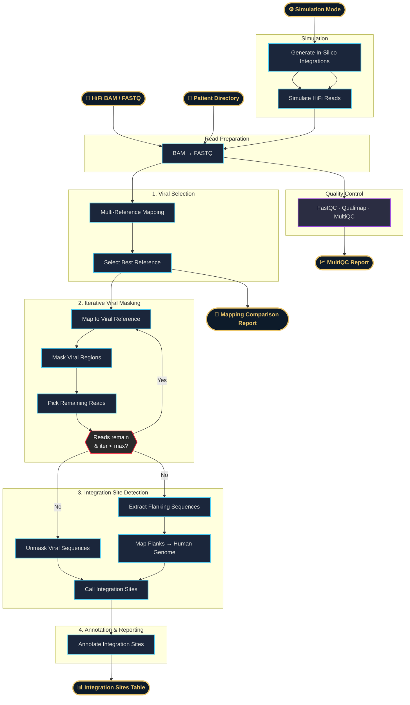

# Detecting viral integration with: NF-Viral-Integration
- This is a nextflow pipeline for detecting HIV (and or general viral) integration sites using PacBio HiFi sequencing data across a host. Implements the SMRTCap methodology with iterative mapping and multi-reference viral genome support.

## Pipeline Overview

```mermaid
flowchart TD
    %% ── STYLES ─────────────────────────────────────
    classDef io fill:#0d1b2a,stroke:#e9c46a,stroke-width:3px,color:#e9c46a,font-weight:bold
    classDef step fill:#1b263b,stroke:#4cc9f0,stroke-width:2px,color:#e0e1dd
    classDef qc fill:#2b2d42,stroke:#9d4edd,stroke-width:2px,color:#e0e1dd
    classDef decision fill:#2a2a2a,stroke:#ef233c,stroke-width:2px,color:#ffffff

    %% ── INPUTS ─────────────────────────────────────
    IN1([🧬 HiFi BAM / FASTQ]):::io
    IN2([📁 Patient Directory]):::io
    IN3([⚙️ Simulation Mode]):::io

    %% ── STEP 0 ─────────────────────────────────────
    subgraph S0["Read Preparation"]
        BTOFQ["BAM → FASTQ<br/>"]:::step
    end

    %% ── SIMULATION ─────────────────────────────────
    subgraph SIM["Simulation"]
        GENINT["Generate In-Silico Integrations"]:::step
        SIMREADS["Simulate HiFi Reads"]:::step
        GENINT --> SIMREADS
    end

    %% ── QC ─────────────────────────────────────────
    subgraph QCSEC["Quality Control"]
        FASTQC["FastQC · Qualimap · MultiQC"]:::qc
    end

    %% ── STEP 1 ─────────────────────────────────────
    subgraph S1["1. Viral Selection"]
        MULTIMAP["Multi-Reference Mapping"]:::step
        SELREF["Select Best Reference"]:::step
    end

    %% ── STEP 2 ─────────────────────────────────────
    subgraph S2["2. Iterative Viral Masking"]
        ITER1["Map to Viral Reference"]:::step
        MASK["Mask Viral Regions"]:::step
        PICK["Pick Remaining Reads"]:::step
        CHECK{{Reads remain<br/>& iter < max?}}:::decision
        ITER1 --> MASK --> PICK --> CHECK
        CHECK -- Yes --> ITER1
    end

    %% ── STEP 3 ─────────────────────────────────────
    subgraph S3["3. Integration Site Detection"]
        UNMASK["Unmask Viral Sequences"]:::step
        FLANKS["Extract Flanking Sequences"]:::step
        MAPHOST["Map Flanks → Human Genome"]:::step
        COMBINE["Call Integration Sites"]:::step
    end

    %% ── STEP 4 ─────────────────────────────────────
    subgraph S4["4. Annotation & Reporting"]
        ANNOT["Annotate Integration Sites"]:::step
    end

    %% ── OUTPUTS ────────────────────────────────────
    OUT1([📊 Integration Sites Table]):::io
    OUT2([🧾 Mapping Comparison Report]):::io
    OUT3([📈 MultiQC Report]):::io

    %% ── FLOW ──────────────────────────────────────
    IN1 & IN2 --> BTOFQ
    IN3 --> GENINT --> SIMREADS --> BTOFQ

    BTOFQ --> MULTIMAP
    BTOFQ --> FASTQC

    MULTIMAP --> SELREF --> ITER1
    CHECK -- No --> UNMASK
    CHECK -- No --> FLANKS

    FLANKS --> MAPHOST
    UNMASK & MAPHOST --> COMBINE --> ANNOT

    ANNOT --> OUT1
    SELREF --> OUT2
    FASTQC --> OUT3
```

## Requirements
- **Nextflow** (Tested on: 25.12.0-edge.10747)
- **Container runtime**: Singularity, Apptainer, or Docker
- **Host reference genome and GTF**: HG38 / T2T
- **HIV viral genomes**: HIV-A, HIV-B, etc.

## Pipeline Methodology
Based on SMRTCap protocol for viral integration detection:

1. Maps HiFi reads to viral reference panel (selects best-matching subtype)
2. Selects mapped reads to most likely viral reference and removes PCR artifacts
3. Iteratively maps to host genome
4. Report integration breakpoints

## Pipeline Overview

This pipeline detects viral integration sites through:
1. **Iterative mapping** to viral and host genomes
2. **Integration site detection** from integrated reads
3. **Multi-reference support** for HIV subtypes (A, B, C, D)

## Input Data

### Required Files
- **PacBio HiFi reads**: FASTQ or BAM format
    -  We assume all samples are demultiplexed and adaptors are removed!
- **Host genome**: FASTA reference (e.g., HG38, T2T)
- **Viral references**: Several FASTAs with viral whole-genomes
- **Nextflow config**: Edited so it handles your HPC/compute environment

## Key Parameters
```bash
--patient_dir    # Input HiFi reads (FASTQ/BAM)
--host_genome    # Host reference genome (FASTA)
--viral_genomes  # Viral reference genome(s) (FASTA)
--annotation     # Host gene annotations (GTF / GFF3)
--outdir         # Output directory [default: ./output]
```

## Container Profiles
```bash
# If using Singularity
-profile singularity

# If using Apptainer
-profile apptainer

# Test if the pipeline works with a lightweight example!
-profile test,singularity
```

### Example Viral Reference Panel
The pipeline supports multiple HIV references for mapping (naming of the fastas are arbitrary in this example):
- Yet, the proviral integration report assumes the naming convention of the provided viral reference genomes. 

```
HIV-1_subtype_A.fa
HIV-1_subtype_B.fa
HIV-1_subtype_C.fa
HIV-1_subtype_D.fa
HIV-2.fa
SIV.fa
```

- We provide you with a reference panel so that you can plug and play!
```
> ls ./nf-viral-integration_t2t/data/hiv_genome_panel_broad | sort

01_AE.JP.1993.NH25_93JPNH25T_93JP_NH2_5T.AB070352.fasta
C.ZM.2002.02ZM112.AB254144.fasta
D.UG.2005.p190049.JX236668.fasta
F1.RO.1996.BCI_R07.AB485658.fasta
H.CD.2004.LA19KoSa.KU168273.fasta
J.CD.2003.LA26DiAn.KU168280.fasta
Ref.A1.UG.92.92UG037_A40.AB253429.fasta
Ref.B.FR.83.HXB2_LAI_IIIB_BRU.K03455.fasta
Ref.G.BE.96.DRCBL.AF084936.fasta
```

- To specify this panel for your work, just change: 
```--viral_genomes ./nf-viral-integration_t2t/data/hiv_genome_panel_broad/*fasta``` setting in ```nextflow.config```

## Download human genome
- We used and reccomend the T2T reference genome for mapping: https://github.com/marbl/CHM13

```bash
# Download T2T and annotation files
wget https://s3-us-west-2.amazonaws.com/human-pangenomics/T2T/CHM13/assemblies/analysis_set/chm13v2.0_maskedY_rCRS.fa.gz
wget https://s3-us-west-2.amazonaws.com/human-pangenomics/T2T/CHM13/assemblies/annotation/chm13v2.0_RefSeq_Liftoff_v5.2.gff3.gz

# Chromatin and Repeats (coming soon)
# wget https://s3-us-west-2.amazonaws.com/human-pangenomics/T2T/CHM13/assemblies/annotation/chm13v2.0_RepeatMasker_4.1.2p1.2022Apr14.bed 
# wget https://s3-us-west-2.amazonaws.com/human-pangenomics/T2T/CHM13/assemblies/annotation/regulation/chm13v2.0_hg002_5mC_hifi_revio_modkit0.1.11.bw 

# Convert GFF3 to GTF
module load singularity

# Genome toolkit
cd sif
singularity pull docker://biocontainers/genometools:v1.5.10ds-3-deb_cv1

# Convert (This is an automated process in the pipleine)
gunzip chm13v2.0_RefSeq_Liftoff_v5.2.gff3.gz
singularity exec genometools_v1.5.10ds-3-deb_cv1.sif \\
  gt gff3_to_gtf chm13v2.0_RefSeq_Liftoff_v5.2.gff3 > chm13v2.0_RefSeq_Liftoff_v5.2.gtf
```

### Predownload SIF images
```bash
# Pre-download SIFs (which will make the pipeline run faster)
module load singularity

# Make sif directory once
mkdir -p ~/sif
cd ~/sif
s
# Pull images for genomics work
singularity pull library://connmurr243/connmurrviral/viralint-r3
singularity pull library://connmurr243/connmurr_viral/viral_int.sif

# QC modules 
singularity pull docker://biocontainers/fastqc:v0.11.9_cv8
singularity pull docker://mgibio/qualimap:v2.3
singularity pull docker://multiqc/multiqc:latest
```

### Testing
Run the built-in test profile to verify your installation works before using real data. This uses a small real-world dataset bundled with the pipeline. You do have to provide a host genome (human) and a gtf. 

```bash
# Load modules
module load singularity 
module load nextflow

# Run pipeline
nextflow run main.nf \
  --host_genome /path/to/host.fa.gz \
  --annotation /path/to/host.gtf \
  -profile test,singularity \
  -resume \
  -bg 
```

## HPC Usage
For SLURM-based HPC systems:

```bash
# Clone the repository
git clone https://github.com/connor122721/nf-viral-integration.git
cd nf-viral-integration

# Load modules
module load singularity 
module load nextflow

# Run pipeline
nextflow run main.nf \
  --patient_dir /path/to/data/ \
  --host_genome /path/to/host.fa.gz \
  --annotation /path/to/host.gtf \
  --viral_genomes /path/to/*.fa \
  --outdir ./nf_output \
  -profile slurm,singularity \
  -resume \
  -bg 
```

Or, to run the pipeline off of GitHub directly use (this pulls the latest version):

```bash
# Load modules
module load singularity 
module load nextflow

# Run pipeline
nextflow run connor122721/nf-viral-integration -latest \ 
  --patient_dir /path/to/data/ \
  --host_genome /path/to/host.fa \
  --annotation /path/to/host.gtf \
  --viral_genomes /path/to/*hiv.fa \
  --outdir ./nf_output \
  -profile slurm,singularity \
  -resume \
  -bg
```

## Output Structure
```
output/
├── 00_QualityControl/       # QC metrics of HiFi data
├── 01_reference_selection/  # Initial viral alignments
├── 02_iterative_masking/    # Exhaustive viral alignments
├── 03_flank_host_mapping/   # Host genome alignments
└── 04_final_results/        # Detected integrations summary statistics
└── 05_report/               # HTML summary of the integration results
```

## Citation
Still in development! If you use this pipeline, please cite:

  ***Development and validation of HIV SMRTcap for the characterization of HIV-1 reservoirs across tissues and subtypes***
  Sadri G, Nadakal ST, Lauer W, Kos J, Singh PK, et al. (2026) Development and validation of HIV SMRTcap for the characterization of HIV-1 reservoirs across tissues and subtypes. *PLOS Pathogens* 22(1): e1013171. https://doi.org/10.1371/journal.ppat.1013171

## Support
For questions or issues:
- Open an issue on [GitHub](https://github.com/connor122721/nf-viral-integration/issues)
- Email: ***connor.murray.2@louisville.edu***

---

**Develped by: Connor S. Murray, Ph.D.**  
University of Louisville School of Medicine | Dept. of Biochemistry & Molecular Genetics